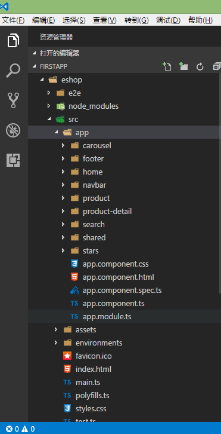
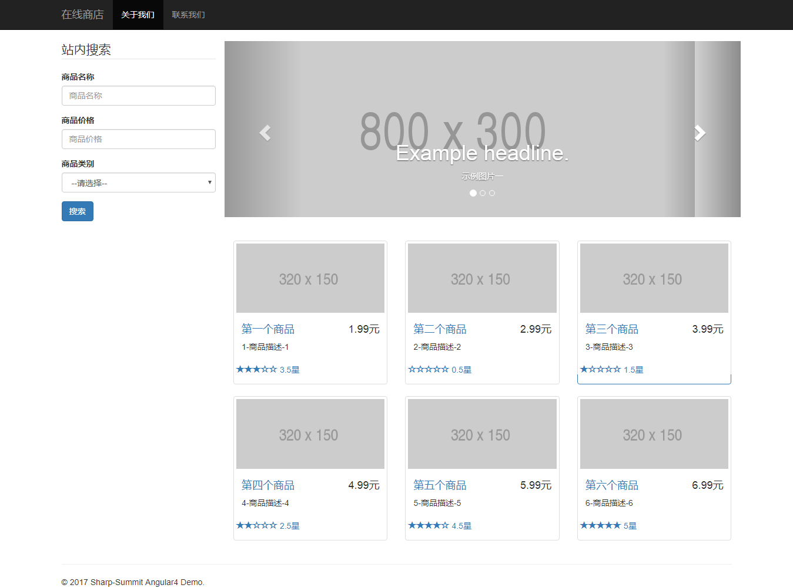

# angular4-eshop
学习慕课网Angular4.0视频做的简易Demo,包含了组件,路由,依赖注入,守卫,管道,服务等功能的实践.  
此项目基于[Angular CLI](https://github.com/angular/angular-cli)构建工具开发.  
###  本Demo环境:  
> *nodejs 6.10  
  *npm 5.02  
  *angualr cli 1.0.4  
  *typescript 2.2
### 运行项目  
```
npm run start # 或npm start 或 ng serve
```
打开`http://localhost:4200/`查看页面效果.附上截图两张:  
主要文件目录结构:  


运行首页效果:  


---
### 附1.
[Angular CLI](https://github.com/angular/angular-cli/wiki)构建工具命令:  
- 首先使用npm安装cli工具  
```
npm install -g @angular/cli
```
- 创建一个项目
```
ng new eshop
```
创建组件/服务/路由等文件,默认创建到app文件夹下.如果创建到app指定目录下直接写路径即可,如:```ng g component shared/product```,这里```g```是generate的缩写形式.以下代码中```ng generate```等效于```ng g```.    
- 运行项目 
```
ng serve  
```
注意编译或者运行时要启用压缩文件,也就是uglifying and tree-shaking特性时
加上控制参数```--prod```,如:```ng build --prod``` or ```ng serve --prod```
- 创建一个组件
```
ng g component product  
# 注意:生成的组件名称自动首字母大写,且带Component后缀
```
- 创建一个服务 
```
ng g service product # 注意:生成的服务名带Service后缀,创建到指定目录下同上.
```
- 创建一个路由模块
```
ng new --routing #注意这里是new命令,也可自己声明路由配置文件.
```
- 创建一个路由守卫服务
```
ng g guard permission
```
- 创建一个模块
```
ng g module permission
```
- 创建一个管道
```
ng g pipe validate 
```
- 创建一个指令
```
ng g directive umeditor
```
除此之外还有创建class,enum,interface的命令,基本上手写,就省略了..  
每一个ng generate [name]命令都有着更精细的控制参数,可在这里查看[ng generate](https://github.com/angular/angular-cli/wiki/generate)


